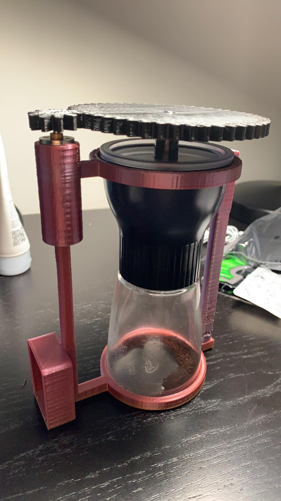

# automated-coffee-grinder

# brief overview of repository
**STL-files:** STL files of the coffee grinder chassis (including revisions), and custom gears.  
**calibration-code:** contains code used to interface an Arduino Uno with a kitchen scale.  
**deep-sleep:** getting the Arduino to be put into deep sleep mode for power preservation purposes (say that fast three times)  
**master-and-slave:** code used to interface an Arduino Uno and NodeMCU using a master (NodeMCU) and slave (Arduino).  
**wifi-stuff:** using two NodeMCUs to talk to each other over Wi-Fi.  
**working-code:** adding everything from the above files together!  

# the fun stuff
**Why?** I love coffee, so I wanted to do something with - you guessed it - coffee!   

My goal is to completely automate a manual coffee grinder. That is, take a manual coffee grinder and make it electric. Then, just for fun, add some IoT functionality so I don't even have to be in the room in order to get it going (ie. while I'm finding the motivation to leave my bed, start the coffee grinder remotely).  

This will be done by using a custom chassis to hold a manual coffee grinder and motor. The motor will turn a set of custom gears (so there is enough torque to grind the coffee),  so that the coffee grinder can be turned autonomously. The setup will be placed on an IoT-enabled scale to detect when the user is running low on coffee (and remind them to refill by sending a message over Wi-Fi). The user can also send data to the coffee grinder over Wi-Fi to give it a command to start, and tell it the desired serving size (eg. one cup, two). The coffee grinder will then start grinding and stop itself once it's reached the desired amount ground (after a certain period of time).  

**overall progress**
- [x] create custom gears for the motor shaft & coffee grinder shaft using AutoDesk Inventor 
- [x] create a custom chassis for the coffee grinder using AutoDesk Inventor 
  - [ ] fix the chassis so that the coffee grinder does not rotate with motor (ie. the body of the coffee grinder has to remain still while the shaft is moving so that the coffee can actually grind) 
    - planning on using bolts that screw into the chassis and at the top of the grinder to keep it in place (brute force solution, for now) 
- [x] get two NodeMCUs communicating wirelessly using Wi-Fi
- [x] interface an Arduino Uno with an HX711 amplifier to communicate with a kitchen scale 
- [x] interface Arduino Uno with NodeMCU as master/slave using I2C communication protocols 
  - [x] get the NodeMCU to issue an interrupt to the Arduino when it needs the Arduino to do things - allows the Arduino to go into deep sleep to save power 
  - [ ] integrate the scale functionality 
- [ ] interface two NodeMCUs as the client/server to add IoT functionality 
  - [ ] test sleep modes to see how interrupts work wirelessly and to save power 
- [ ] control the motor with the Arduino and a 24V battery pack 
- [ ] develop a simple web/mobile app to communicate with NodeMCUs for user-friendly experience 
  - [ ] get the server NodeMCU to listen to the app 
  - [ ] get the two NodeMCUs to communicate effectively 
- [ ] connect everything together (and make sure it works for the full user experience!)

You can see a draft version of the chassis here (battery pack is not pictured):  

