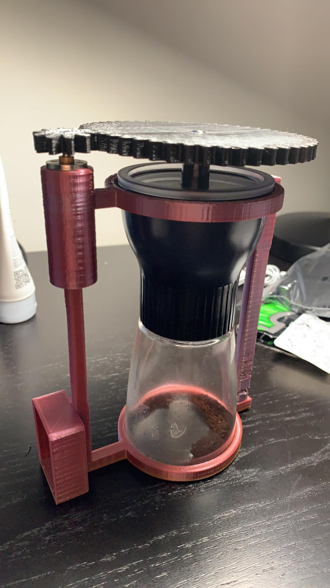

# STL files  
STL files used for the project. They include:  
- a custom set of 5:1 gears for the shaft of the motor, and the shaft of the coffee grinder; 
- and a custom chassis for the coffee grinder, to add space for a battery pack, motor, and the manual coffee grinder itself.  

I've also added different versions of the chassis so you can see my troubleshooting skills & progress I've made. Although changes were minor (usually had to do with extrusion directions/lengths), they were definitely important as the chassis is quite complex and has a small margin of error.  

You can see a box on the chassis - that's meant for the battery pack. I didn't cut out a hole for the wires to go through for this print (but my STL files have one) and decided not to push the pack in as it would be quite tight and thus difficult to get out.  

**current issues**  
- [ ] the shaft of the gear that goes on top of the motor has worn down - a new piece needs to be printed 
- [ ] the coffee grinder spins with the motor, meaning no coffee actually gets ground
  - possible solutions include a tighter fit & increased friction (eg. hot glue on the inside), using screws to hold the grinder in place 
- [ ] a final version of the chassis still needs to be printed
