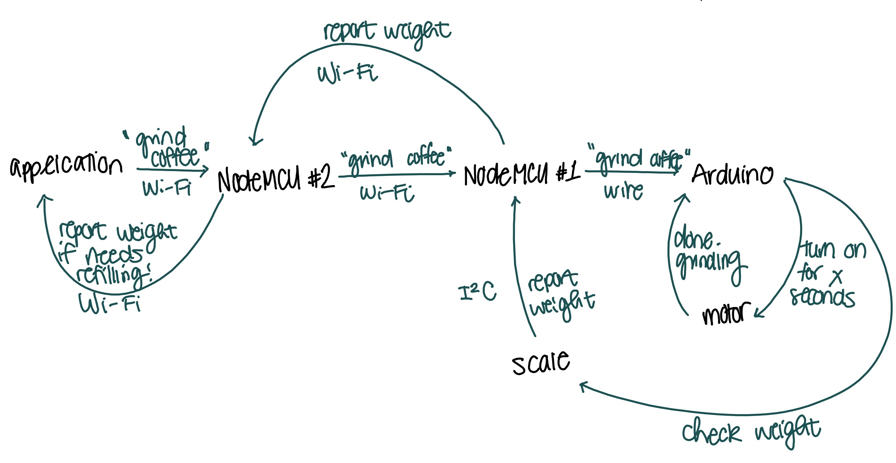

# deep-sleep
This folder contains code testing the deep sleep functionality. The goal is to be able to issue an interrupt from the NodeMCU to wake the Arduino. Since we are not using the Arduino 99.9% of the time (and we are also using battery power), this will help in preserving battery life.  

The goal, in the future, is to be able to have a second NodeMCU which will communicate over Wi-Fi. It will work something like this:  

Obviously, the "grind coffee" interrupt will only be issued once or twice a day (hopefully, not more, but this is alas the life of an engineering student) so deep sleep functionality is important. Stay tuned for updates.
